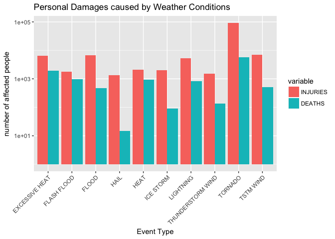
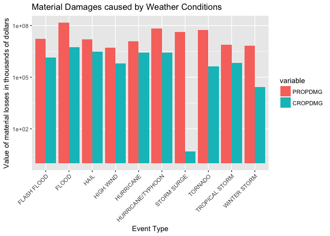

# Severe Weather Condition and Socioeconomic impact across the United State between 1950 and 2011
Roberto Diaz Ortega  
5/3/2017  


### Synopsis
Severe weather events has a direct impact over the public health and local economy due to the losses derived from this events in properties and crops. 

This project use the database from U.S. National Oceanic and Atmospheric Administration's (NOAA) storm database in order to evaluate what kind of severe weather events have the most important impact in society and economy. In order to achieve the main objective this study will report the relationship between the number of injuried and death people and the severe weather conditions and also the relationship between the losses in properties and crops due to the servere weather conditions.

### Data Proccessing
In order to start de analysis it is neccesary to get the complete dataset from the web:

```r
#Data Source
url<-"https://d396qusza40orc.cloudfront.net/repdata%2Fdata%2FStormData.csv.bz2"
datasetFileName<-"FStormData.csv.bz2"

#Download the data files and extract the dataset files
if(!file.exists(datasetFileName)){
    download.file(url,datasetFileName,method="curl")
}

#Load dataset from files if aren't already loaded into memory
if (!exists("rawDataset")){
    rawDataset <- read.csv(datasetFileName, stringsAsFactors = FALSE)
}
```

The rawdataset has a lot of information which will not be used in this report, for this reason a data subset has been created including only the interest columns, eventType, injuries, death and damages in properties and crops.


```r
filtered_dataset<-subset(rawDataset, select=c('EVTYPE','INJURIES','FATALITIES','PROPDMG','PROPDMGEXP','CROPDMG','CROPDMGEXP'))
```

In the rawdataset the property damages and crop damages need some work in order to adjust and clean the column values:

```r
#replace all strange symbols by X
filtered_dataset$PROPDMGEXP[filtered_dataset$PROPDMGEXP==''||filtered_dataset$PROPDMGEXP=='-'||filtered_dataset$PROPDMGEXP=='?']<-'X'

#map value for EXP columns
exp_unit<-c('K'=10^3,'M'=10^6,'X'=0,'B'=10^9,'m'=10^3,'H'=10^2,'h'=10^2,'0'=1,'1'=10,'2'=10^2,'3'=10^3, '4'=10^4,'5'=10^5,'6'=10^6,'7'=10^7,'8'=10^8,'k'=10^3,'?'=0)

#This function will apply the correct EXP to the value column to get the correct ammount
fix_units<-function(x, columnName){
    if (x[paste(columnName,'DMGEXP',sep="")] %in% names(exp_unit)){
        as.numeric(x[paste(columnName,'DMG',sep="")]) * exp_unit[x[paste(columnName,'DMGEXP',sep="")]]
    } else
        0
}

#Apply the adjust function to PROPDMG and CROPDMG columns
filtered_dataset$PROPDMG<-apply(filtered_dataset,1,fix_units,'PROP')
filtered_dataset$CROPDMG<-apply(filtered_dataset,1,fix_units,'CROP')
filtered_dataset<-subset(filtered_dataset, select=-c(PROPDMGEXP,CROPDMGEXP))
```

In this point, the dataset is cleaned and ready to be processed. The aggregate function will allow to split the dataset by the different severe events and calculate the sum of the interest variables (both personal and material damages) in the whole period of time. 


```r
#create a summarize version for personal damages
personalDamages <- aggregate(cbind(filtered_dataset$INJURIES, filtered_dataset$FATALITIES),by=list(filtered_dataset$EVTYPE),FUN=sum, na.rm=TRUE)
colnames(personalDamages)<-c("EVTYPE", "INJURIES","DEATHS")

#create a summarize version for material damages
materialDamages <- aggregate(cbind(filtered_dataset$PROPDMG, filtered_dataset$CROPDMG),by=list(filtered_dataset$EVTYPE),FUN=sum, na.rm=TRUE)
colnames(materialDamages)<-c("EVTYPE", "PROPDMG","CROPDMG")

#Order the personal and material damages
personalDamages<-personalDamages[order(-personalDamages$INJURIES,-personalDamages$DEATHS),]
materialDamages<-materialDamages[order(-materialDamages$PROPDMG,-materialDamages$CROPDMG),]
```
### Results

From the data proccessing section has been obtained two datasets ready to be plotted. The first plot shows the relationship between the personal damages and severe weather conditions.


```r
library(ggplot2)
library(reshape2)

preparedPersonalDamage<- melt(personalDamages[1:10,], id.vars='EVTYPE')
personalDamagePlot<- ggplot(preparedPersonalDamage, aes(EVTYPE, value), log10="y") + 
    geom_bar(aes(fill = variable), position = "dodge", stat="identity") +
    scale_y_continuous(trans='log10') + 
    theme(axis.text.x = element_text(angle = 45, hjust = 1))+
    xlab("Event Type")+
    ylab("number of affected people") + 
    ggtitle("Personal Damages caused by Weather Conditions")
print(personalDamagePlot)
```

<!-- -->

The second plot shows the relationship between the several weather conditions and the material losses prodoced by them. 


```r
preparedMaterialDamage<- melt(materialDamages[1:10,], id.vars='EVTYPE')
materialDamagePlot<- ggplot(preparedMaterialDamage, aes(EVTYPE, value/10^3)) + 
    geom_bar(aes(fill = variable), position = "dodge", stat="identity") +
    scale_y_continuous(trans='log10') + 
    theme(axis.text.x = element_text(angle = 45, hjust = 1))+
    xlab("Event Type")+
    ylab("Value of material losses in thousands of dollars") + 
    ggtitle("Material Damages caused by Weather Conditions")
print(materialDamagePlot)
```

<!-- -->

### Conclusions

Derived from the previous analysis it can be extracted the Tornados are the cause of the majority of personal damages across the United States. On the other hand, floods are the most important cause of material losses.
